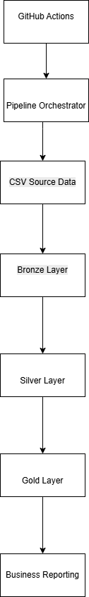

# Retail Analytics Platform

An end-to-end Data Engineering project built with Snowflake using a Medallion Architecture (Bronze, Silver, Gold).

## Features

- Snowflake Data Warehouse
- Internal Stages
- COPY INTO Data Loading
- Data Quality Validation
- Bronze / Silver / Gold Architecture
- Star Schema Modeling
- Revenue Analytics
- GitHub Version Control

## Tech Stack

- Snowflake
- SQL
- GitHub
- VS Code / Codespaces

## Architecture

Data flows through a Medallion Architecture:

CSV Files → Snowflake Stage → Bronze → Silver → Gold → Analytics

---

## Data Ingestion

Raw CSV files are uploaded into a Snowflake internal stage before being loaded into Bronze tables.

---

## Bronze Layer

Raw source data is loaded into Bronze tables using Snowflake COPY INTO commands.

---

## Silver Layer

The Silver layer performs cleansing, standardization, and deduplication of source data.

---

## Gold Layer

Dimensional modeling was implemented using a star schema consisting of fact and dimension tables.

---

## Revenue Analysis

The Gold layer supports business reporting and KPI generation.

# Retail Sales Data Pipeline

A production-style Data Engineering project implementing the Medallion Architecture.

## Features

- Bronze Layer (Raw Data)
- Silver Layer (Cleaned Data)
- Gold Layer (Business Metrics)
- Data Quality Testing
- Pipeline Orchestration
- GitHub Actions CI/CD

## Architecture

## Screenshots

### Stage Files

### Bronze Validation

### Silver Layer

### Gold Layer

### Revenue Metrics

### Architecture

## Technologies Used

- Python
- Pandas
- Snowflake
- SQL
- Git
- GitHub Actions
- Medallion Architecture
- ETL Pipelines
- Data Quality Validation
