# Retail Analytics Platform


End-to-end Snowflake Data Engineering project implementing a Medallion Architecture (Bronze, Silver, Gold) for retail analytics.

The platform ingests raw e-commerce data, applies data quality validation, builds dimensional models, generates business KPIs, and monitors pipeline health through automated validation checks.

---

## Key Features

* Snowflake Data Warehouse
* Medallion Architecture
* Star Schema Modeling
* Data Quality Framework
* Pipeline Monitoring
* Business KPI Analytics
* GitHub Actions CI/CD
* Automated CI/CD validation using GitHub Actions
* Real Snowflake-connected orchestration using Python
* Pytest data quality checks executed against Snowflake tables
* Technical Documentation

---


Replace it with this:

:::writing{variant="standard" id="74821"}
## Architecture

The platform follows a Medallion Architecture pattern with automated orchestration, validation, and monitoring.

```mermaid
flowchart TD
    A[Raw CSV Files] --> B[Snowflake Internal Stage]
    B --> C[Bronze Layer<br/>Raw Source Tables]
    C --> D[Silver Layer<br/>Cleaned, Standardized, Deduplicated Tables]
    D --> E[Gold Layer<br/>Star Schema]
    E --> F[Business Analytics Queries]
    E --> G[Data Quality Checks]
    E --> H[Pipeline Monitoring]

    I[Python Orchestration<br/>orchestration/pipeline.py] --> C
    I --> D
    I --> E
    I --> F
    I --> G
    I --> H

    J[GitHub Actions CI/CD] --> I
    K[Pytest Validation] --> G

---

## Data Ingestion

Raw CSV files are uploaded into Snowflake Internal Stages and loaded using COPY INTO commands.

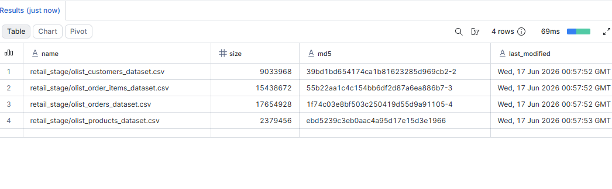

---

## Bronze Layer

The Bronze Layer stores raw source data exactly as received from source systems.

Validation confirms successful ingestion of all source records.

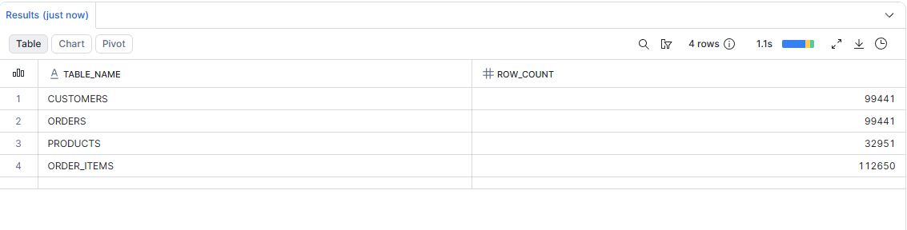

---

## Silver Layer

The Silver Layer performs cleansing, standardization, and validation before data is promoted to analytics-ready layers.

Key transformations include:

* Duplicate Removal
* Null Handling
* Standardization
* Data Validation

### Silver Tables

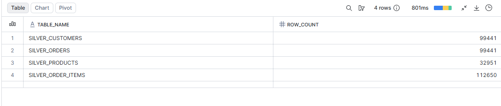

### Duplicate Validation

Duplicate detection ensures data quality before loading downstream analytics tables.

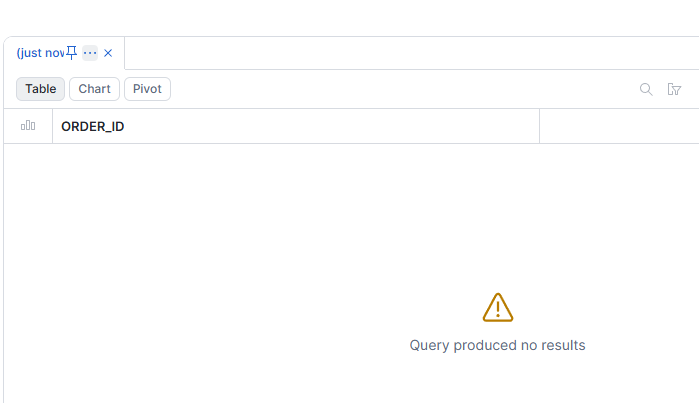

---

## Gold Layer

The Gold Layer contains business-ready dimensional models optimized for reporting and analytics.

Implemented Star Schema:

* DIM_CUSTOMER
* DIM_PRODUCT
* DIM_DATE
* FACT_SALES

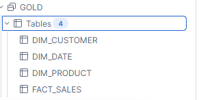

---

## Business Analytics

The platform supports KPI generation and business reporting.

### Total Revenue KPI

Calculates total revenue generated across all transactions.

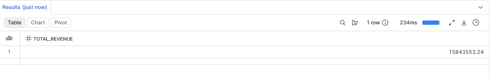

### Monthly Revenue Trend

Analyzes revenue performance over time.

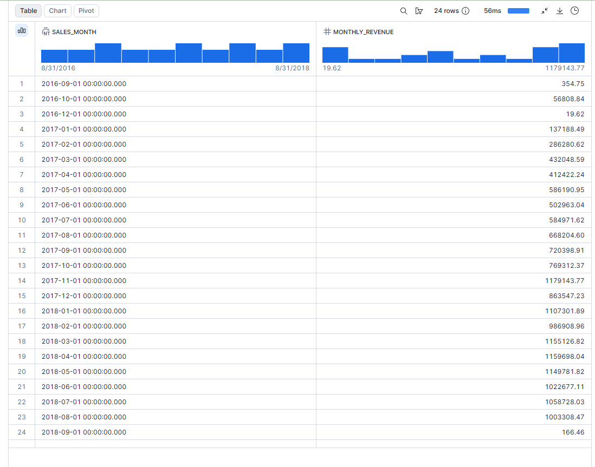

### Top Products Analysis

Identifies the highest revenue-generating products.

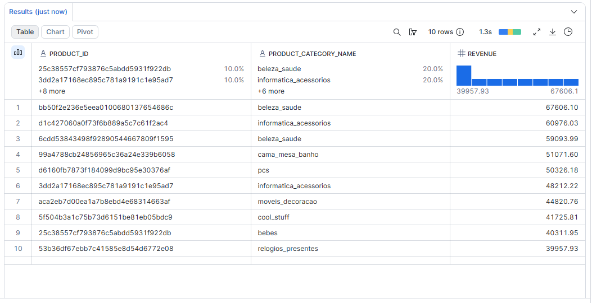

---

## Data Quality Framework

A comprehensive validation framework was implemented to ensure business users can trust analytics generated from the Gold layer.

### Validation Categories

* Null Value Checks
* Duplicate Detection
* Row Count Reconciliation
* Freshness Validation
* Referential Integrity Validation

### Data Quality Validation

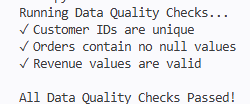

### Data Quality Summary

Provides a consolidated validation dashboard across the pipeline.

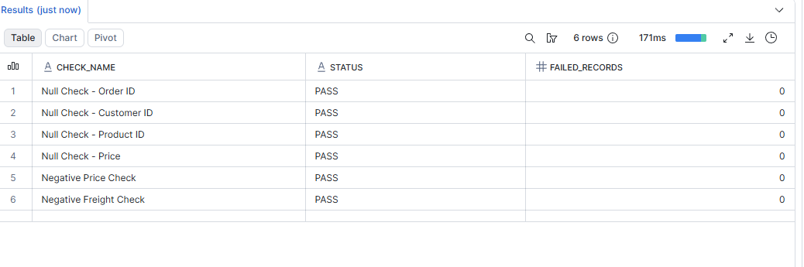

### Row Count Validation

Validates consistency between Bronze, Silver, and Gold layers.

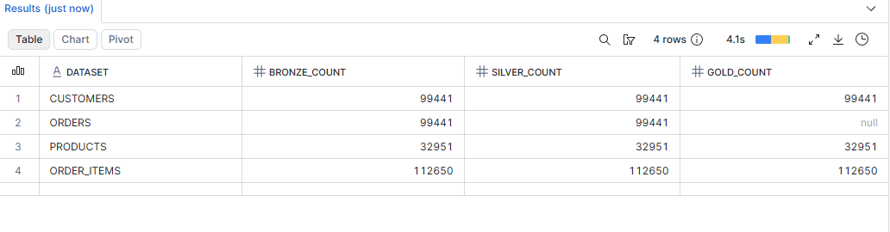

### Null Value Validation

Validates critical business columns are populated.

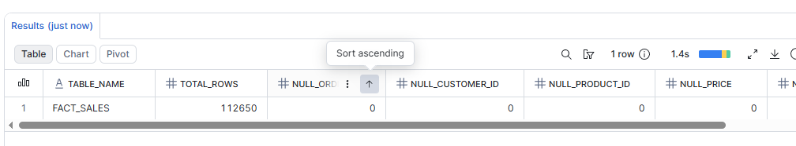

### Duplicate Detection

Identifies duplicate records that may impact business metrics.

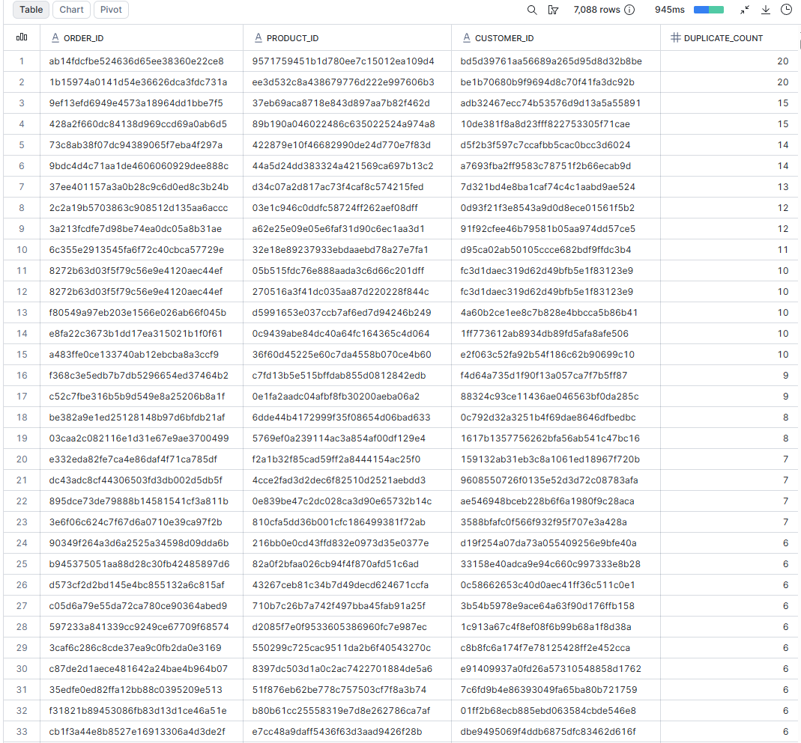

### Freshness Validation

Validates the timeliness of available business data.

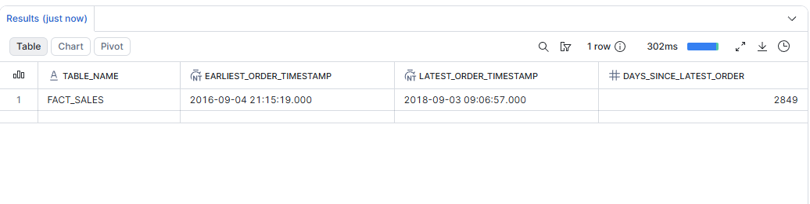

### Referential Integrity Validation

Ensures all fact records have valid dimension table relationships.

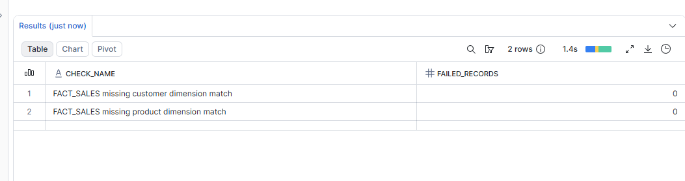

---

## Pipeline Monitoring

Monitoring was added to validate operational health and reliability of the platform.

### Pipeline Health Check

Tracks:

* Total records loaded
* Distinct customers
* Distinct orders
* Distinct products
* Revenue totals
* Available data range

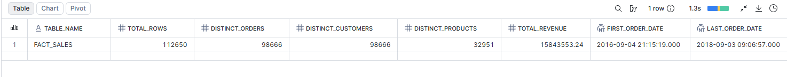

### Table Load Summary

Validates row counts across Bronze, Silver, and Gold layers.

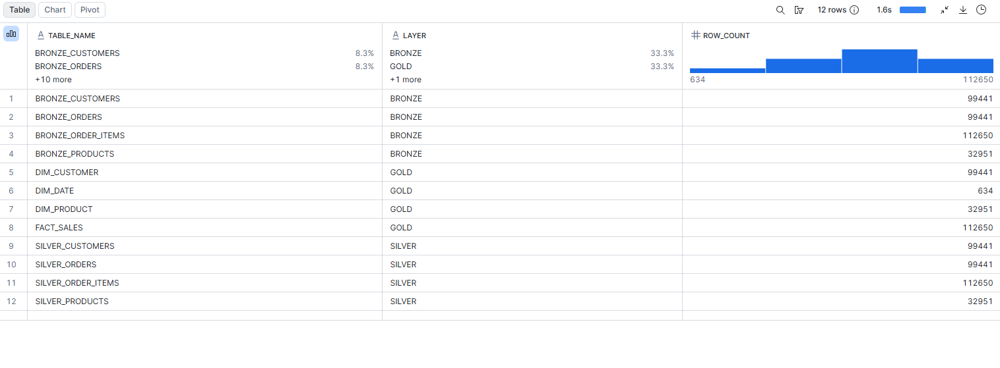

### Business KPI Summary

Provides a consolidated operational KPI dashboard.

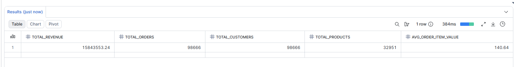

---

## Automated Validation

This project includes a GitHub Actions workflow that validates the Snowflake pipeline on push and pull request.

The workflow performs the following checks:

* Installs Python dependencies
* Compiles Python orchestration and test scripts
* Runs the Snowflake pipeline using `orchestration/pipeline.py`
* Executes pytest-based data quality checks against Snowflake
* Validates fact and dimension tables, null checks, revenue checks, and referential integrity

Current validation result: Passing

---

## Failure Handling

The Python orchestration script runs SQL files in dependency order across Bronze, Silver, Gold, Analytics, Data Quality, and Monitoring layers.

If a SQL statement fails, the pipeline raises an error that includes:

* The SQL file that failed
* The statement number inside the file
* A preview of the failed SQL statement
* The original Snowflake error message

This causes the pipeline and GitHub Actions workflow to fail fast instead of silently continuing with incomplete or unreliable data.

Example failure behavior:

```text
Pipeline failed while running sql/analytics/customer_lifetime_value.sql
SQL execution failed in sql/analytics/customer_lifetime_value.sql, statement 3
```

This makes pipeline failures easier to debug and improves operational reliability.

---

## Repository Structure

```text
retail-analytics-platform/

├── .github/workflows/
├── docs/
├── orchestration/
├── screenshots/
├── sql/
│   ├── analytics/
│   ├── bronze/
│   ├── data_quality/
│   ├── gold/
│   ├── monitoring/
│   └── silver/
└── tests/
```

---

## Skills Demonstrated

### Snowflake

* Databases
* Schemas
* Internal Stages
* File Formats
* COPY INTO
* Analytical SQL

### Data Engineering

* Data Warehousing
* ETL / ELT Development
* Medallion Architecture
* Data Pipeline Design
* Data Quality Validation
* Pipeline Monitoring
* Dimensional Modeling

### SQL

* Joins
* Aggregations
* KPI Development
* Business Analytics
* Data Validation

### Software Engineering

* Python Orchestration
* Pytest Validation
* Git
* GitHub
* GitHub Actions CI/CD
* Technical Documentation
* Version Control

---

## Future Enhancements

* Snowflake Streams
* Snowflake Tasks
* dbt Integration
* Apache Airflow Orchestration
* Power BI Dashboard Layer
* Automated Alerting
* Data Observability Framework

---

## Author

Retail Analytics Platform

Snowflake Data Engineering Portfolio Project demonstrating Data Warehousing, Analytics Engineering, Data Quality Validation, Pipeline Monitoring, Python Orchestration, and Automated CI/CD Validation.
