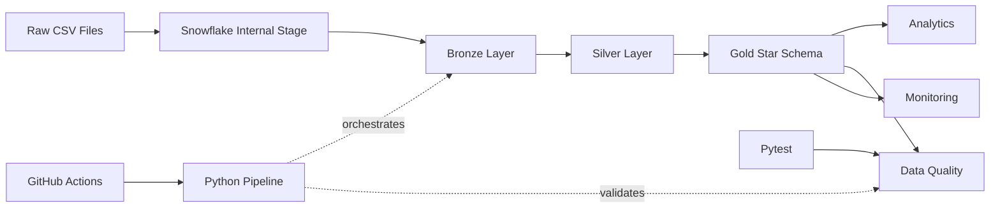
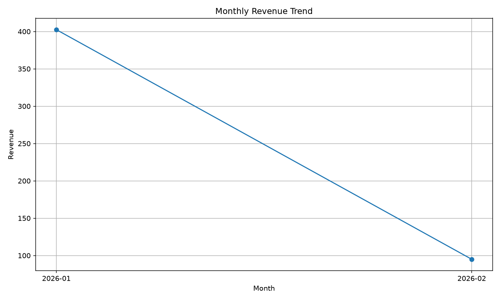
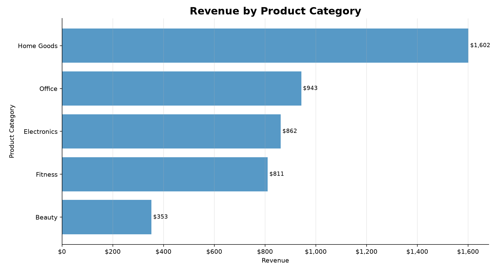
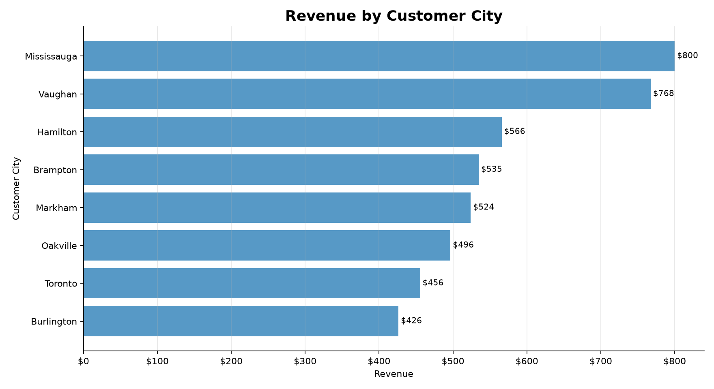

# Retail Analytics Platform


End-to-end Snowflake Data Engineering project implementing a Medallion Architecture for retail analytics using Bronze, Silver, and Gold layers.

The platform ingests raw e-commerce data, applies data quality validation, builds dimensional models, generates business KPIs, creates sample visualizations, and monitors pipeline health through automated validation checks.

For local setup and execution instructions, see [SETUP.md](SETUP.md).

For CI/CD setup and GitHub Actions secrets documentation, see [CI_CD.md](CI_CD.md).

---

## Key Features

* Snowflake Data Warehouse
* Medallion Architecture
* Bronze, Silver, and Gold Data Layers
* Star Schema Modeling
* Python Pipeline Orchestration
* Data Quality Framework
* Pipeline Monitoring
* Business KPI Analytics
* Sample Data Generator
* Visualization Layer
* Pytest Data Quality Checks
* GitHub Actions CI/CD
* Secret-Based Snowflake Configuration
* Failure Handling and Debug Logging
* Technical Documentation

---

## Architecture

The platform follows a Medallion Architecture pattern with automated orchestration, validation, and monitoring.



---

## Sample Data

This project includes a synthetic sample data generator for local testing and demonstration.

Run:

```bash
python scripts/generate_sample_data.py
```

This creates sample CSV files under:

```text
data/sample/
```

Generated files:

```text
olist_customers_dataset.csv
olist_orders_dataset.csv
olist_products_dataset.csv
olist_order_items_dataset.csv
```

These files follow the same naming pattern expected by the Bronze ingestion scripts.

---

## Data Ingestion

Raw CSV files are uploaded into Snowflake Internal Stages and loaded using `COPY INTO` commands.


---

## Bronze Layer

The Bronze Layer stores raw source data exactly as received from source systems.

Validation confirms successful ingestion of all source records.


---

## Silver Layer

The Silver Layer performs cleansing, standardization, deduplication, and validation before data is promoted to analytics-ready layers.

Key transformations include:

* Duplicate removal
* Null handling
* Standardization
* Data validation
* Filtering invalid revenue records
* Window-function-based deduplication

### Silver Tables


### Duplicate Validation

Duplicate detection ensures data quality before loading downstream analytics tables.


---

## Gold Layer

The Gold Layer contains business-ready dimensional models optimized for reporting and analytics.

Implemented Star Schema:

* `DIM_CUSTOMER`
* `DIM_PRODUCT`
* `DIM_DATE`
* `FACT_SALES`

The Gold Layer includes surrogate keys, business keys, revenue measures, order dates, and load timestamps to support analytics, reporting, and validation.


---

## Business Analytics

The platform supports KPI generation and business reporting from the Gold Layer.

### Total Revenue KPI

Calculates total revenue generated across all transactions.


### Monthly Revenue Trend

Analyzes revenue performance over time.


### Top Products Analysis

Identifies the highest revenue-generating products.


---

## Visualization Layer

This project includes a simple visualization layer to demonstrate how curated analytics outputs can support downstream BI and reporting.

The visualization layer currently includes:

```text
monthly_revenue.png
revenue_by_category.png
revenue_by_city.png
```

Run:

```bash
python scripts/create_visualizations.py
```

### Monthly Revenue Trend

Shows revenue performance over time using generated sample order data.



### Revenue by Product Category

Shows which product categories generate the most revenue.



### Revenue by Customer City

Shows revenue distribution across customer locations.



---

## Data Quality Framework

A validation framework was implemented to ensure analytics generated from the Gold Layer can be trusted.

### Validation Categories

* Null value checks
* Duplicate detection
* Row count reconciliation
* Freshness validation
* Referential integrity validation
* Surrogate key validation
* Revenue validation
* Load timestamp validation

### Data Quality Validation


### Data Quality Summary

Provides a consolidated validation dashboard across the pipeline.


### Row Count Validation

Validates consistency between Bronze, Silver, and Gold layers.


### Null Value Validation

Validates critical business columns are populated.


### Duplicate Detection

Identifies duplicate records that may impact business metrics.


### Freshness Validation

Validates the timeliness of available business data.


### Referential Integrity Validation

Ensures fact records have valid dimension table relationships.


---

## Pipeline Monitoring

Monitoring was added to validate operational health and reliability of the platform.

### Pipeline Health Check

Tracks:

* Total records loaded
* Distinct customers
* Distinct orders
* Distinct products
* Revenue totals
* Available data range


### Table Load Summary

Validates row counts across Bronze, Silver, and Gold layers.


### Business KPI Summary

Provides a consolidated operational KPI dashboard.


---

## Automated Validation

This project includes a GitHub Actions workflow that validates the Snowflake pipeline on push and pull request.

The workflow performs the following checks:

* Installs Python dependencies
* Compiles Python orchestration and test scripts
* Runs the Snowflake pipeline using `orchestration/pipeline.py`
* Executes pytest-based data quality checks against Snowflake
* Validates fact and dimension tables
* Checks null values, revenue values, surrogate keys, load timestamps, and referential integrity

Current validation result: Passing

---

## Optional Airflow Orchestration

This project includes an optional Apache Airflow DAG to demonstrate production-style orchestration concepts such as scheduling, task dependencies, retries, and failure handling.

The DAG is located at:

```text
airflow/dags/retail_analytics_pipeline_dag.py
```

The DAG includes the following task flow:

```text
generate_sample_data
    -> run_snowflake_pipeline
    -> run_data_quality_tests
    -> create_visualizations
```

Airflow retry behavior is configured with:

```text
retries: 2
retry_delay: 5 minutes
catchup: false
schedule: daily
```

The Airflow DAG is optional and does not replace the main Python orchestration script. The primary pipeline can still be run directly using:

```bash
python orchestration/pipeline.py
```

---

## Failure Handling

The Python orchestration script runs SQL files in dependency order across Bronze, Silver, Gold, Analytics, Data Quality, and Monitoring layers.

If a SQL statement fails, the pipeline raises an error that includes:

* The SQL file that failed
* The statement number inside the file
* A preview of the failed SQL statement
* The original Snowflake error message

This causes the pipeline and GitHub Actions workflow to fail fast instead of silently continuing with incomplete or unreliable data.

Example failure behavior:

```text
Pipeline failed while running sql/analytics/customer_lifetime_value.sql
SQL execution failed in sql/analytics/customer_lifetime_value.sql, statement 3
```

This makes pipeline failures easier to debug and improves operational reliability.

---

## Repository Structure

```text
retail-analytics-platform/

├── .github/
│   └── workflows/
├── airflow/
│   └── dags/
├── data/
│   └── sample/
├── docs/
├── orchestration/
├── screenshots/
├── scripts/
│   ├── generate_sample_data.py
│   └── create_visualizations.py
├── sql/
│   ├── analytics/
│   ├── bronze/
│   ├── data_quality/
│   ├── gold/
│   ├── monitoring/
│   └── silver/
├── tests/
├── visualizations/
├── CI_CD.md
├── README.md
├── SETUP.md
└── requirements.txt
```

---

## Skills Demonstrated

### Snowflake

* Databases
* Schemas
* Warehouses
* Internal Stages
* File Formats
* `COPY INTO`
* Analytical SQL
* Dimensional Modeling

### Data Engineering

* Data Warehousing
* ETL / ELT Development
* Medallion Architecture
* Data Pipeline Design
* Data Quality Validation
* Pipeline Monitoring
* Star Schema Modeling
* Reproducible Setup Documentation
* Failure Handling

### SQL

* Joins
* Aggregations
* Window Functions
* KPI Development
* Business Analytics
* Data Validation
* Referential Integrity Checks

### Python

* Pipeline Orchestration
* Snowflake Connector
* CSV Data Generation
* Visualization Script
* Error Handling
* Pytest Validation

### Software Engineering

* Git
* GitHub
* GitHub Actions CI/CD
* Secret-Based Configuration
* Technical Documentation
* Version Control
* Automated Testing

---

## Future Enhancements

* Snowflake Streams
* Snowflake Tasks
* dbt Integration
* Apache Airflow Orchestration
* Power BI Dashboard Layer
* Automated Alerting
* Data Observability Framework
* Dockerized Local Runtime

---

## Author

**Taha M. Taha**  
Data Engineer | Snowflake | SQL | Microsoft Fabric | Data Warehousing  

GitHub: [ttaha07](https://github.com/ttaha07)

This project was built as a Snowflake Data Engineering portfolio project demonstrating data warehousing, analytics engineering, data quality validation, pipeline monitoring, Python orchestration, automated CI/CD validation, sample data generation, and downstream visualization.