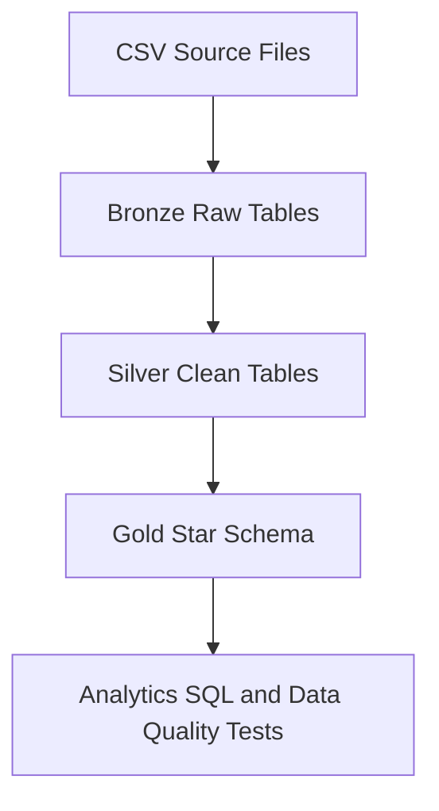

# Architecture

This project implements a Snowflake retail analytics platform using a medallion architecture. Raw CSV files are loaded into Bronze, cleaned in Silver, and modeled into Gold fact and dimension tables for analytics.

